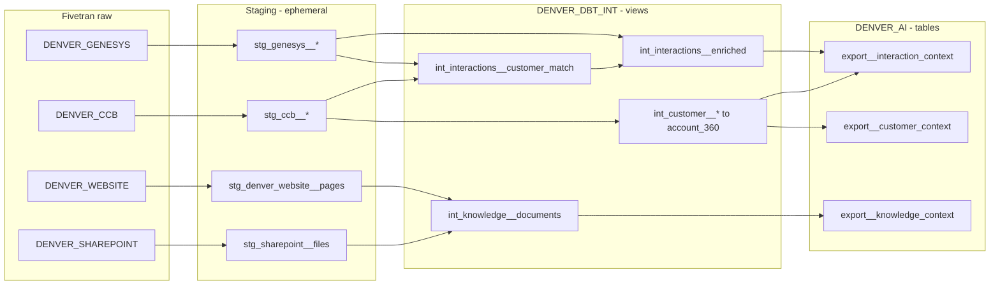

# Denver Water dbt Context Layer

dbt project `denver-water-dbt/denver_water_dbt` that turns the four Fivetran-synced
sources into AI Context export tables for the Customer Experience Agent Assist POC.
It follows the Autotask dbt project (`Kaseya-KnowledgeHub/autotask-dbt/autotask_dbt`)
as the reference pattern, with Denver-specific additions (four sources, customer
matching, three exports).

Status: local build complete on DuckDB (all models and tests pass). Snowflake is
validated through Fivetran Transformations (not yet deployed).

## Decisions

| Decision | Choice |
|---|---|
| Snowflake database | `FIVETRAN_DATABASE_DENVER` |
| Raw schemas | `DENVER_GENESYS`, `DENVER_CCB`, `DENVER_WEBSITE`, `DENVER_SHAREPOINT` (Connector SDK naming: unprefixed, uppercase tables) |
| Staging | ephemeral, one source per model, no cross-system joins |
| Intermediates | views in `DENVER_DBT_INT` |
| AI exports | tables in `DENVER_AI` |
| Validation | views in `DENVER_DBT_VALIDATION` |
| Export shape | hybrid: OKF contract `id`, `title`, `url`, `content` plus structured columns |
| Genesys / CC&B URLs | always null; documents cite `genesys:interaction:<id>` / `ccb:account:<id>` and carry `data_classification` |
| Knowledge URLs | genuine DenverWater.org page URLs (SharePoint URLs once text exists) |
| SharePoint | metadata staged only; excluded from the knowledge export until text extraction exists |
| Raw tables | never modified |
| Embeddings | out of scope for this phase |

## Step 0 findings (Snowflake, verified in Snowsight)

- 21 raw tables; row counts match the synthetic CSVs; no soft-deleted rows.
- Genesys links to CC&B only by customer phone/email (no shared key); 200/200
  interactions match exactly one CC&B person.
- `ACCOUNT_PERSONS.END_DATE` and `SERVICE_HISTORY.END_DATE` do not exist.
- The premise points to the account (`PREMISES.ACCOUNT_ID`), not the other way round.
- `CONTACT_NOTES.CREATED_BY` is a Genesys `USER_ID`.
- SharePoint: 15 files (13 knowledge DOCX, `README.txt`, `SHAREPOINT_DOCUMENT_MANIFEST.csv`);
  no text column. `CUSTOM_METADATA` is a VARIANT of Microsoft Graph fields.
- Website: 40 pages, all with genuine `https://www.denverwater.org/...` URLs.
- Type differences: Snowflake has DATE / TIMESTAMP_TZ / NUMBER; the local DuckDB
  warehouses store dates and timestamps as VARCHAR. Normalization macros handle both.

## Layout

```
denver_water_dbt/
  dbt_project.yml            vars, layer materializations/schemas, enable_sharepoint toggle
  profiles.yml               DuckDB only (attaches the three local connector warehouses)
  macros/
    generate_schema_name     custom schema used verbatim (Autotask)
    yaml_value, markdown_link, format_ts, full_trim, string_agg_ordered   (Autotask, dispatch = denver_water_dbt)
    normalize_timestamp      normalize_timestamp / normalize_date (UTC, adapter-aware)
    normalize_contact        normalize_phone (10 digits) / normalize_email
    okf_helpers              md_line, md_money, md_yes_no, md_list_or
  models/
    staging/{genesys,ccb,denver_website,sharepoint}/   21 models + source/model YAML
    intermediate/{customer,interactions,knowledge}/     12 models
    marts/ai/                                           3 exports
    validation/                                         3 reports
  tests/{sources,staging,intermediate,marts}/           singular tests
```

## Data flow



## Staging

All models drop soft-deleted rows (`_fivetran_deleted`) and add `synced_at` (UTC).

- **Genesys (6):** users, queues, wrap_up_codes, interactions, participants, transcripts.
  Interactions get `customer_phone_norm` / `customer_email_norm`.
- **CC&B (13):** persons (`phone_norm`, `alternate_phone_norm`, `email_norm`, `full_name`),
  accounts (`account_number` as text), account_persons, premises (zip padded to 5),
  service_points, meters, bills, payments, consumption, contact_notes
  (`created_by_user_id`), field_activities (`is_open`), service_history, lead_program.
  Money is `decimal(12,2)`.
- **Website (1):** `stg_denver_website__pages` with `source_url`, `category_group`,
  `content_length`, and `content_as_of_at` (last-modified, else scraped-at) plus its basis.
- **SharePoint (1, Snowflake only):** `stg_sharepoint__files` with file name, extension,
  document code (e.g. `KB-001`), title, `is_knowledge_document`, genuine `source_url`.

## Intermediates

**Customer** (grain: account unless noted)

| Model | Purpose |
|---|---|
| `int_customer__person_accounts` | person-to-account links (grain: account_person_id) |
| `int_customer__account_service` | premise, service point, meter, lead program |
| `int_customer__billing_summary` | latest bill, open bills, last payment, 12-month window from the latest bill |
| `int_customer__usage_summary` | latest usage vs. 12-month average, usage flag |
| `int_customer__activity_summary` | bounded markdown lists: open field activities, recent contact notes, recent service history (limits set by vars) |
| `int_customer__account_360` | one row per account combining all of the above plus interaction count |

**Interactions** (grain: interaction)

| Model | Purpose |
|---|---|
| `int_interactions__transcript` | ordered `[YYYY-MM-DD HH:MM] Speaker: message` text |
| `int_interactions__customer_match` | Genesys to CC&B match: phone (primary or alternate) first, then email. Multiple candidate persons = `ambiguous`, no customer attached. Account pick: primary relationship, then active, then most recent |
| `int_interactions__enriched` | interaction + queue, agent, wrap-up, transcript, match |

**Knowledge** (grain: document)

| Model | Purpose |
|---|---|
| `int_knowledge__website_documents` | public pages; summary kept only when it is a real meta description (under 500 characters) |
| `int_knowledge__sharepoint_documents` | internal knowledge DOCX metadata, `content` null, `is_content_available = false` (Snowflake only) |
| `int_knowledge__documents` | union with a shared column list |

## AI exports (`DENVER_AI`)

| Model | Grain | `id` | `url` | Rows (synthetic) |
|---|---|---|---|---|
| `export__customer_context` | account | account number | null | 60 |
| `export__interaction_context` | interaction | interaction id | null | 200 |
| `export__knowledge_context` | content-available document | `denverwater_org:<page_id>` | genuine page URL | 40 |

`content` is OKF: YAML frontmatter (ids, source system, `source_reference`,
`data_classification`) followed by markdown sections.

- **Customer:** Account Overview, Customer, Service and Meter, Billing, Usage,
  Field Activities, Contact Notes, Service History, Lead Program, Contact Center History.
- **Interaction:** Interaction Summary, Transcript, Customer Snapshot (bounded;
  explicit message when unmatched), Customer Match.
- **Knowledge:** title, summary (if any), page text; frontmatter includes URL,
  category, content-as-of date and hash.

## Validation (`DENVER_DBT_VALIDATION`)

| Report | Local result |
|---|---|
| `rpt_source_row_counts` | 20 tables (21 on Snowflake), staged = raw non-deleted for all |
| `rpt_customer_match_rate` | 160 phone (80%) + 40 email (20%), 0 ambiguous, 0 unmatched; all on primary relationship |
| `rpt_knowledge_coverage` | website 40 documents, 40 with text, 40 exported. SharePoint appears on Snowflake as 13 documents, 0 exported |

Demo accounts ACC0001 to ACC0008 were spot-checked: each has a customer document and
4 matched interactions whose reasons line up with the account data (e.g. ACC0001
"High water bill" with a HIGH usage flag; ACC0003 "Lead Reduction Program" with
"Suspected Lead").

## Tests

- **Sources:** primary keys unique/not null, verified foreign keys, accepted values
  (some set to warn); singular tests for one primary person per account, unique
  transcript sequence, one customer participant per interaction, customer contact present.
- **Staging:** model primary keys; normalized phones are 10 digits (warn).
- **Intermediate:** unique grain per model; match is never ambiguous-with-customer;
  account_360 covers every account; match rate at least 90% (warn).
- **Exports:** OKF columns not null, `id` and `source_reference` unique, accepted values,
  interaction accounts exist in the customer export, knowledge URLs unique;
  `assert_no_synthetic_citation_urls`, `assert_knowledge_urls_are_genuine`,
  `assert_demo_accounts_have_interactions` (only when `poc_synthetic_data` is true).
- **Validation:** every source table's row count matches staging.

## Vars

| Var | Default | Purpose |
|---|---|---|
| `denver_database` | `FIVETRAN_DATABASE_DENVER` | raw database |
| `genesys_schema` / `ccb_schema` / `website_schema` / `sharepoint_schema` | `DENVER_*` | raw schemas |
| `enable_sharepoint` | true on Snowflake, false on DuckDB | SharePoint sources, models, tests |
| `poc_synthetic_data` | `true` | `data_classification` = `synthetic_poc`; enables the demo test |
| `context_open_field_activity_limit` / `context_contact_note_limit` / `context_service_history_limit` | 3 | caps on bounded lists |

## Running

Local (DuckDB, same as Autotask). Run `fivetran debug` in the Genesys, CC&B and
website connectors first so their `files/warehouse.db` exist, then:

```
cd denver-water-dbt/denver_water_dbt
dbt build --profiles-dir .
```

Snowflake: deploy through Fivetran Transformations using Fivetran's own connection
(no Snowflake target in `profiles.yml`). The default vars already point at the
Step 0 schemas.

## Known limitations

- SharePoint documents have no text yet, so internal knowledge is not in the export.
- Genesys and CC&B have no citable URLs in the POC; `url` is null for those exports.
- Customer matching relies on phone/email only; ambiguous matches deliberately attach
  no customer.
- Some website pages are long (up to about 20k characters); chunking belongs with the
  later embeddings work.

## Next steps

1. Deploy to Fivetran Transformations and run the full build on Snowflake
   (first run of the SharePoint models and adapter-specific macros).
2. If Fivetran AI Context requires a relation literally named `EXPORT`, add thin
   `alias='export'` models per export.
3. SharePoint text extraction, then include SharePoint in the knowledge export.
4. Embeddings / vectorization.
